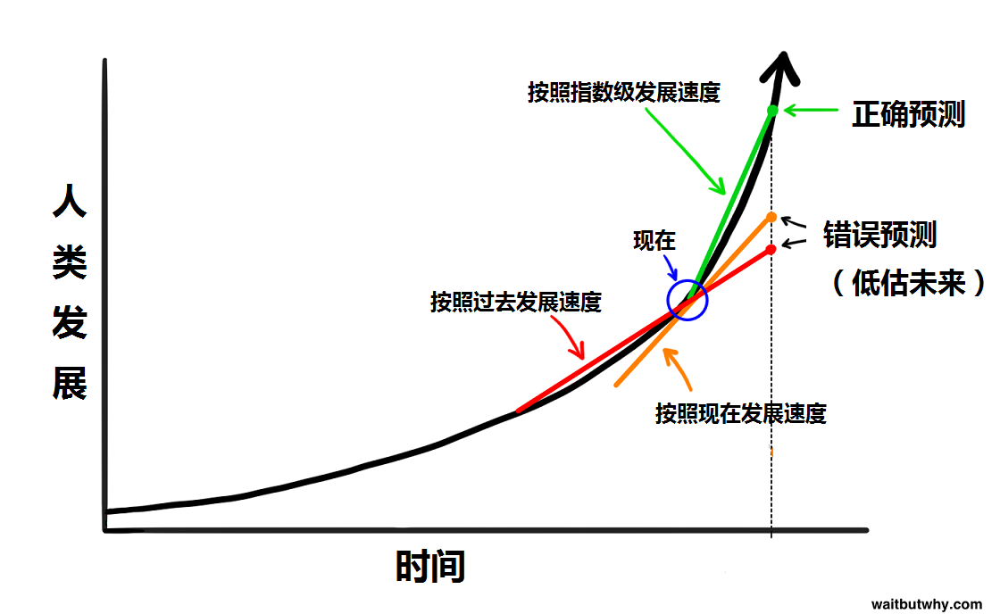
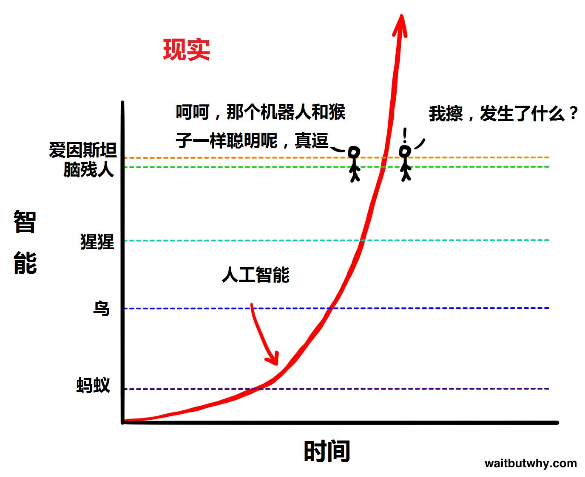
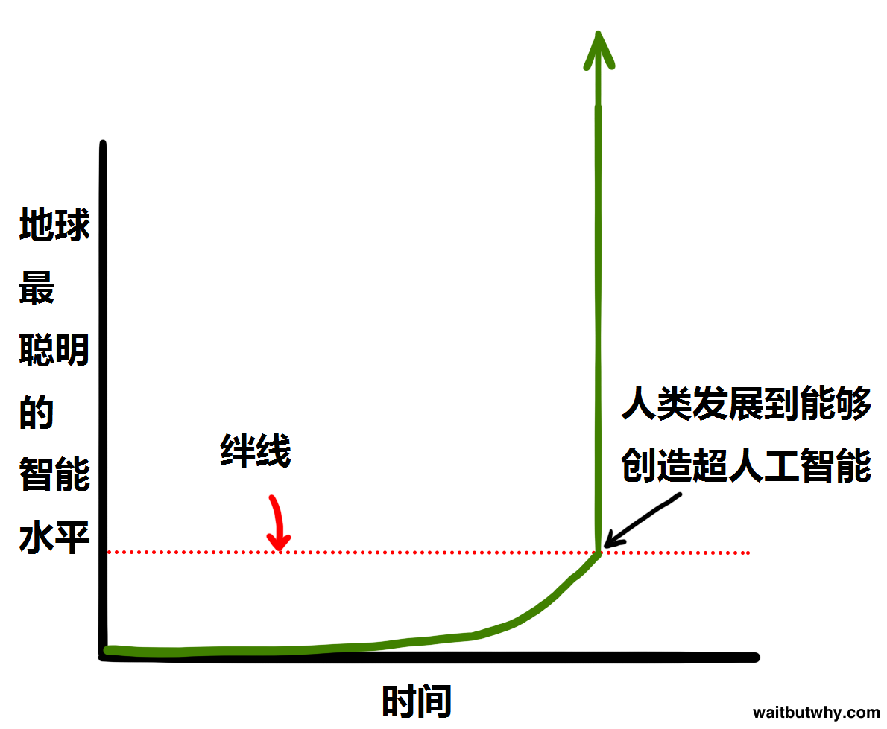

前言：  
现在是2025年，AI已经非常热门。我想通过本文，谈谈我个人对AI的理解，展望，以及事业上的帮助和发展。  

## 站在过去时间点，看待现在的AI。站在现在的时间点，预测未来的AI。  
### 一篇2015年1月预测AI发展的文章
在**2015年1月27号**，有这么一篇文章发布了，颠覆了我对AI认知！这里附上翻译后的文章地址：  
[人工智能很可能导致人类的永生或者灭绝，而这一切很可能在我们的有生之年发生。](https://zhuanlan.zhihu.com/p/19950456)  
有兴趣可以详细阅读全文！我强烈建议看看！  
在本篇文章中，我重点引用两点结论：  
1.人类科技发展是指数级增长的！  


2.AI发展将可能一瞬间超越人类认知！  



站在当时看，大多数人都会觉得无稽之谈。毕竟2015年1月，连openai都没成立。我们看下时间线
```
2015年 – OpenAI 成立，专注于通用人工智能（AGI）。
2016年 – AlphaGo 战胜李世石，标志AI在围棋上超越人类。
2017年 – Transformer 结构（Google提出）引领NLP革命，成为后续GPT、BERT等模型的基础。
2019年 – GPT-2（OpenAI）发布，展示强大的文本生成能力。
2020年 – GPT-3（1750亿参数）发布，开启AI生成内容（AIGC）热潮。
2022年 – ChatGPT（基于GPT-3.5） 发布，迅速成为爆款产品。
2023年 – GPT-4 发布，性能大幅提升，支持多模态输入（文本、图像）。
2023年及以后，大量AI产品涌现。
```

如果你看过这篇文章，你现在应该会非常惊讶。这篇文章预测的简直一模一样，简直太有前瞻性了！  
**在10年前，连互联网才普及没多久，在大多数人都还刚用上智能手机时。该文的作者，已经准确预测到了10后的当下的AI发展。**  
这里我再一次强烈推荐还没看该文的小伙伴，去阅读一下！  

历史证明该文正确性。那我们再看看，10年的该文，对2025年现在之后是怎么预测的。  
  
该文将人工智能分为3个阶段，弱人工智能，强人工智能，超人工智能。我相信大家都认可，当下我们人类已经实现了强人工智能。  

个人的总结是：  
1. 当超人工智能来临的一瞬间，他的智能将在一瞬间远远超过所有人类的集合。以难以置信，夸张的指数成长。人类因此灭亡或永生。
2. 最乐观的估计是2030年出现，保守估计是2050年，悲观是2080年甚至永远不会出现超人工智能。  


目前所有AI本质上都是模拟人脑来实现的。我们从算力角度看看这个问题：  
```
截至 2024 年，全球最快的超级计算机（如 Frontier）已经达到了 1.2 EFLOPS（即 1.2 × 10¹⁸ FLOPS）。
由于人脑的运作方式与计算机不同，很难直接比较，但通常的估算范围是 1 EFLOPS 到 100 EFLOPS（10¹⁸ 到 10²⁰ FLOPS）。
```
可以见得，当下最强的算力已经接近人脑了。我一直认为，当计算机算力超过人脑时，智能也会非常接近人脑。现在看，强如o3（即便他的算力还远远够不上人脑）已经远远超过的绝大部分人。未来呢？未来算力继续增长会发生什么？  

综上，我认为AI智能依旧如该文预测一样，还会飞速指数级变强。甚至达到强人工智能。

### 一篇2023年12月我写下对AI理解和运用的文章  
在GPT3的时候，我已经开始大量的使用AI了。特别是GPT-4的出现，让我技术实力，眼界，思维飞跃式的提升。  
原文链接：[ai使用心得](https://baohongjiang.com/p/ai%E4%BD%BF%E7%94%A8%E5%BF%83%E5%BE%97/)  
直到现在，有更多更强大的AI产品出现。现在的我应用能力大幅度增涨，更加确信当时的我判断和思路是正确的。  
也就是下一章，我要表达内容。

## 基于AI，天翻地覆的根本上的解决问题方式和思维改变。  
我引用我之间的结论：  
**人的生命是有限的，掌握不了如此多的知识和技能。  
AI颠覆了传统学习与实践方式，掌握框架，细节交给AI，从而极大提升效率和能力上限。**  

从以下几点描述：  
```
### AI彻底革新了知识学习和技能掌握的方式
传统学习模式需要全面掌握知识体系，而AI可以辅助完成具体细节，极大加快学习速度。
只需要掌握知识体系的“树干”，细节“树叶”可以通过AI补充。

### AI加速实践，从学习到落地的效率大幅提升
以往需要完整掌握才能动手做的项目，现在只需要知道大致可行性，就能借助AI快速推进。
例如，博客搭建、AI公众号、AI对话网页等项目，都是先有概念，然后通过AI完善细节并落地。

### AI是高效的执行助手，但上限仍由个人决定
AI能作为辅助工具帮助解决已有成熟方案的问题，但对前沿探索性问题仍有局限。
人的能力和思维深度决定了最终成就，AI只是放大器。

### 实践是关键，使用AI的最佳方式是“动手”
真正的提升来源于实际使用，技巧在实践中自然习得。
“能用就用、折腾起来”，比空谈技巧更重要。
```

作为我个人而言，我现在约80%以上的事务，都由AI介入。不限于工作和开发。  
DeepSeek R1强大思维逻辑能力，可以从各个问题的各个角度去思考。其眼界和知识，远超当下的自己。如果有一天，真正的能学会这种结构化的思维，那简直不敢想象。  
如我所描述的，实践是关键，深度用过，自然就懂。没用过就像镜花水月，多说无益。  

## 当下各类AI的盘点  
截止写问的2025年3月12日，我归纳总结市面上大部分流行，以及我用过的AI产品。总结其特点和优缺点。包括但不限于LLM大模型。抛砖引玉，供各位参考：  

1. LLM大模型类  
    - GPT系列  
        - o3 ,o1  作为当下最强，也是最贵的推理模型。拥有超高（o1为200K）的上下文，是当前推理和逻辑能力最强的模型。特别擅长代码分析和逻辑推理。只有他小弟们解决不了，一般才会考虑动用这位大哥。  
        - o1-mini，o3-mini，o3-mini-high 作为上面的mini版，在性能，价格，速度上有优势。困难代码问题一般先请他们解决。  
        - 4o 作为多模态模型。全面，快速。可以直接看懂图片，解析音频。速度和价格都很优秀。是当下我最常用的模型。  
        - 4.5 作为最新的GPT模型，创意和人性化水平强很多。但是价格非常非常昂贵。我一般用于创意和文案方面。
        - 其它GPT模型 其它都是弟中弟，除了便宜一点点，没有任何优点。不予讨论
    - DeepSeek系列
        - R1 作为当下中文推理能力最强，极具性价比的推理模型。其强大之处，我相信各位有目共睹。价格低廉，特别擅长中文场景下的各类问题推理。重点强调的是，其代码能力相比其他模型较弱，非常不推荐写代码。我一般用于各类中文味很强的问题。很贴地气。
        - V3 没有推理能力的版本。一般很少使用。
        - 其它参数版 DeepSeek强就强在用最少的算力和硬件，实现了堪比gpt-4o的能力。现在很多网站用鸡贼的用32B，70B参数版冒充671B满血版。这里特提的原因是，R1 32B 4位量化版，是在4090 24G家用显卡下能本地部署最好的模型。经体验，一般用于涉及保密的问题。
    - Claude系列
        - Claude3.7 有多个版本，一般常用为Sonnet。该模型为当下除了GPT以外，算老二了。用起来非常人性化，大量使用过的人表示，其代码能力强于GPT-4o。关键是交互非常人性化，canvas就是其率先引入的。同时，github copilot还将其纳入会员中。足以证明其代码能力的性价比。一般用于交叉验证GPT代码。
    - Gork系列
        - Gork3 马斯克家的AI，据说推理用算力是目前最强的。用下来和其他家在代码能力上没有明显优势。重点强调的是，其内容政策审核极为宽松。
    - Gemini系列
        - Gemini2.0 google家的。得益于google强大的技术实力，速度非常快。原生多模态。同时在搜索能力上，明显强于其它模型。（毕竟google嘛~）一般用的较少，智能上相比其他的没有明显优势。
    - 其它各类及本地模型
        - 在抱脸上，有大量的各类模型，国内也有QwQ等，各有优缺点。大多数都是参数较少，特化针对某个领域的专业产品。在有限的精力下，我们一般不考虑和使用。
    - manus
        - 大量信息显示，就是一场炒作和骗局。等真正用上了，再看看是不是金子。
2. AI绘图类
    - Stable Diffusion 大名鼎鼎的SD，开源且可高度定制。根据调用的底模不同，可以绘制各类题材画风。甚至可以结合多种插件玩出各种花活。在家用电脑上就可以轻松部署和绘画。缺点也很明显，结果内容全看底模，使用难度也偏高。
    - Midjourney 也是大名鼎鼎的MJ。能力非常强，仅能通过使用其服务画画。极多样的画风。但缺点也是，缺乏定制，价格较为昂贵。和SD正好是两个极端。
    - DALL-E 3 比上面两个差远了。唯一的优点就是融入到原生的GPT网页服务中。实在没啥用。
3. TTS类（文本转语音）
    - VITS系列
        - VITS最早版本由国人发布，经过大量的fork各种二次加工。目前最强开源是GPT-SoVITs。只要几分钟的音频源，就可以推理出非常相似的多语言语音。家用电脑就足够微调训练和推理。  
        以下是我“动手”出来的：  
        我声音的推理版  
        <audio controls>
            <source src="my_AI.wav" type="audio/mpeg">
        </audio>  
        二战解说原声  
        <audio controls>
            <source src="ww2Start.wav" type="audio/mpeg">
        </audio>  
        二战解说AI合成  
        <audio controls>
            <source src="ww2Start_AI.wav" type="audio/mpeg">
        </audio>  
    - 其它各家类 微软TTS，谷歌TTS，抖音，都是闭源的。必须定制化微调，成本较高。否则的话，只能用他们训练好的。总体效果已经也非常棒了！  
4. STT类（语音转文本）
    - Whisper Openai开源产品，支持上百种语言的识别。是目前开源STT最强选手。家用电脑即可本地部署。
    - 其它类 微软谷歌讯飞等等，都有大量API可调用。


## 个人对AI未来应用的展望和思考  

我认为AI已经彻底的改变了我思维方式，解决问题的路径。  
~~当然要是超人工智能出现，人类直接毁灭了就没有意义了。我们当下必然是以AI将会带领我们人类科技突破为出发点。~~  
在这个时代，我们必须紧跟时代，不断提升自我，不断接收新的知识。  
**世界上唯一不变的，就是变化本身。**  
经历国内市场虚假需求的繁荣日子后，我认为，AI本身并没有像其它技术那样自己就可以带来很大的价值。它必须和各类领域结合，才能发挥奇妙的化学反应。  
例如和互联网开发，传统零售，传统机械加工，文学影视，教育等等等等。  

无论如何，我们都应该作为一个创业者去思考。让AI给我们完善细节，帮我们打工才是正道。构建自己的知识框架，不再拘泥于细节。抓住问题的本质和主要矛盾。  
在未来，我将更加深度的使用AI到我任何事务中。同时我也希望能提升所有团队成员的AI应用水平，并改进工作流。  


两篇参考视频，读懂AI技术起源：  
[【计算机博物志】自然语言处理的“古往”和“今来”](https://www.youtube.com/watch?v=RUtvBkibIT8)  
[为什么费曼技巧被称为终极学习法](https://www.youtube.com/watch?v=7iNJyEbYDdc&t=408s)  