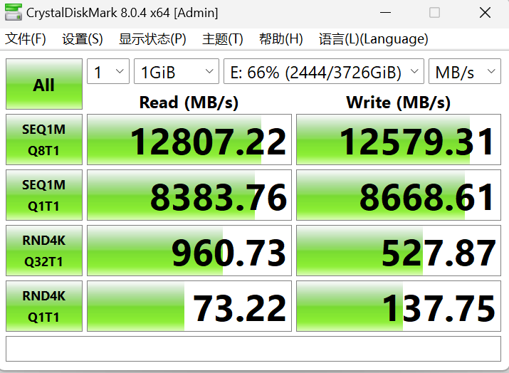
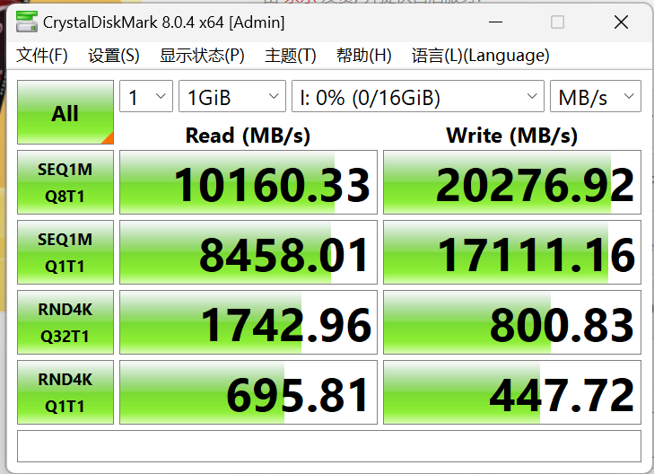

今年618的时候，搞了一台超牛逼的PC。13900k+4090，CPU和GPU都是水冷的。这么牛逼的电脑，当然每一项都尝试最求更好。这里讨论追求极致的硬盘速度。  
这里吹一下，国产长江颗粒确实牛。把固态的价格彻底打下来了！  

废话不多说，进入正题。  

## 追求极致的硬盘速度
经过大量研究，准备采用RAID 0，正好主板也支持。（基本是装游戏，代码多有github托管。虽有丢失风险，也能接受。后面会单独讨论）
买了长江颗粒的梵香，单张读写声称能到7500MB/s。
我组了2张为一个RAID 0 。速度如下  

  

极限顺序读写都约为12000MB上下，也就是12G/s！这个速度干啥都得劲啊！  
考虑到RAID 0会出现1+1<2 的情况，也算基本事实。  

我们都知道内存的速度也是非常快，一般在几十G/s。我的内存也非常大32G*2 4800mhz，一般情况一半都用不了。我突发奇想，或许可以搞一个内存盘试试速度。  

  

可以看到，极限顺序读写性能非常高。但和SSD好像差距不大。再组个固态进RAID 0，3个固态速度上完全可以超越内存盘。  

但假如我们仔细看，发现RamDisk随机4K读写性能比固态盘快非常多！在rnd4k Q1T1下，速度甚至是10倍！  
毕竟我们日常使用，还是随机4K最能体验出快慢。  

为什么随机4k速度差这么多？  
众所周知，内存本来就是擅长大量寻址的。固态则不然，主控速度慢很多。  

这里我们还可以敏锐的察觉到，内存的延迟远远低于固态。rnd4k Q1T1 和rnd4k Q32T1，Q是并发数量。当为Q1T1 时，只有单进程在调。前面不调完，读写不会继续下去。  
我们可以发现，固态的延迟比较高，内存的延迟比较低。  
固态平均延迟：  
1/(73.22*1000/4) ≈ 0.054ms  
内存盘平均延迟：  
1/(695*1000/4) ≈   0.0057ms  

以上延迟符合硬件常识。  
可以见得内存盘随机4K确实非常快，而且固态盘再也难以超越这个延迟上限。  

### 结论
固态盘和内存盘的顺序读写能力，并没有大的差距。甚至固态盘加持RAID后，会更高。
内存盘的4K随机读写远远超过固态盘，因为内存延迟远远比固态低一个数量级！这也导致了单线程4K速度，内存盘比固态盘快10倍！但是在极限4K读写，固态和内存盘几乎差距很小，完全可以增加RAID中的固态来加速。   

但内存的价格远远超过固态，一个2T国产固态只要500+，一个32G内存要1500+。  
除非你真有什么对延迟非常敏感的场景，要不然我一律推荐使用固态组建RAID。  

### 关于其它数据库和redis
数据库一般瓶颈是4K读写速度。历史上很长一段时间，都是机械银盘，极限顺序读写也就几十MB。和内存差几百倍。  
redis就是把数据库搬到了内存上，以获得极高的4K读写性能。所以大量高并发业务都用redis。并在一定周期内硬盘的数据库同步。  

但是，大人时代变了。通过我的测试，你可以发现。组RAID，固态的读写能力也非常强悍了！（当然，我们测试用的是内存盘，而不是纯内存。这里速度会有成倍的减少。）  
RAID还可以组成丰富的备份阵列，保证数据万物一失。价格也美丽。关键redis也需要不少人力和精力去学，去维护。  

诚然redis依旧对传统放在硬盘的上的数据库在并发能力上有优势。。但说实话，就我们游戏开发这行来说，一般情况，直接用传统硬盘数据库就可以了，几千几万的并发，固态就能抗住。（要是几十万并发，那业务肯定赚大钱了，必然有专业的后端团队）直接花个几千，买个N个固态，组个速度又快，又能双重备份的RAID 10 即可。同时配合定期冷备，热备。成本低并发高。  

另外再日常使用中内存盘用途也优势，所以内存盘的软件现在真的是很难找。hhh。

