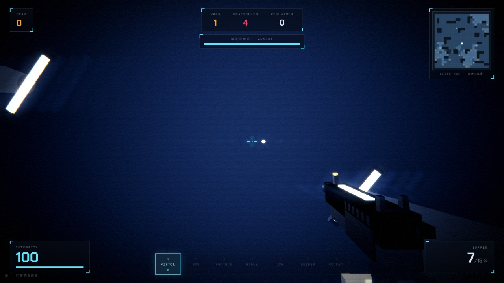
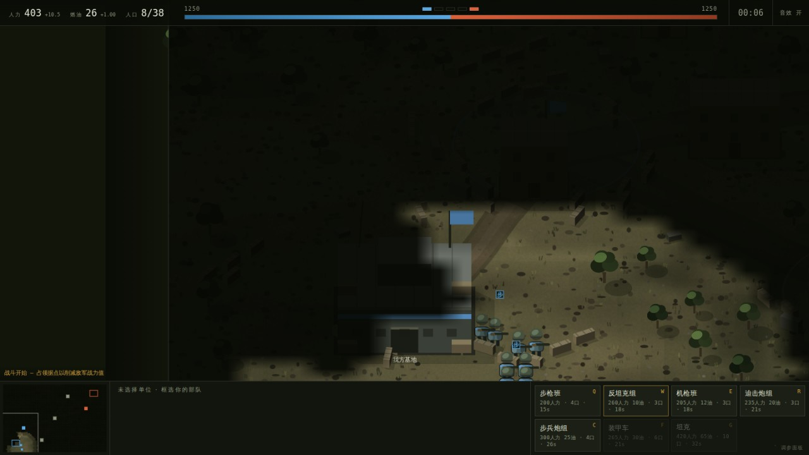

No download — the link is the game.

## VOID PROTOCOL

First-person wave shooter. You're a reclamation process dropped into a block being freed — nothing inside it was ever finished, which is why every texture, sound, model and animation is generated in code at runtime. Not a single asset file.

Platform: PC · no mobile support

  <a href="/games/void-protocol/" target="_blank" rel="noopener"
     style="display:inline-block;padding:1em 3.4em;border-radius:10px;font-size:1.15em;
            background:#05070c;color:#5fe6ff;border:2px solid #5fe6ff;letter-spacing:.18em;
            font-weight:700;text-decoration:none;box-shadow:0 0 22px rgba(95,230,255,.35)">
    ▶ PLAY NOW
  </a>

## FRONTLINE

2.5D real-time strategy. No workers, no mining — income comes from the strongpoints you hold. Cover decides damage, suppression decides advance, flanking decides the match.

Platform: PC · no mobile support

  <a href="/games/frontline/" target="_blank" rel="noopener"
     style="display:inline-block;padding:1em 3.4em;border-radius:10px;font-size:1.15em;
            background:#14100a;color:#e0a54a;border:2px solid #e0a54a;letter-spacing:.18em;
            font-weight:700;text-decoration:none;box-shadow:0 0 22px rgba(224,165,74,.35)">
    ▶ PLAY NOW
  </a>

More to come, one at a time.
