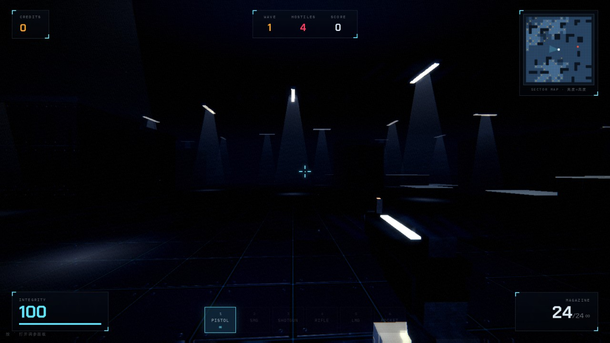

不用下载，浏览器打开就是游戏。

## VOID PROTOCOL

第一人称波次射击。贴图、音效、模型、动画全是代码在运行时生成的，一个素材文件都没有。

终端：PC · 移动端未适配

  <a href="/games/void-protocol/" target="_blank" rel="noopener"
     style="display:inline-block;padding:1em 3.4em;border-radius:10px;font-size:1.15em;
            background:#05070c;color:#5fe6ff;border:2px solid #5fe6ff;letter-spacing:.18em;
            font-weight:700;text-decoration:none;box-shadow:0 0 22px rgba(95,230,255,.35)">
    ▶ 开 始 游 戏
  </a>

## 战线 FRONTLINE

2.5D 即时战略。没有农民，没有采矿，资源来自你占领的据点。掩体决定伤害，压制决定推进，侧翼决定胜负。

终端：PC · 移动端未适配

  <a href="/games/frontline/" target="_blank" rel="noopener"
     style="display:inline-block;padding:1em 3.4em;border-radius:10px;font-size:1.15em;
            background:#14100a;color:#e0a54a;border:2px solid #e0a54a;letter-spacing:.18em;
            font-weight:700;text-decoration:none;box-shadow:0 0 22px rgba(224,165,74,.35)">
    ▶ 开 始 游 戏
  </a>

后续做一个加一个。
