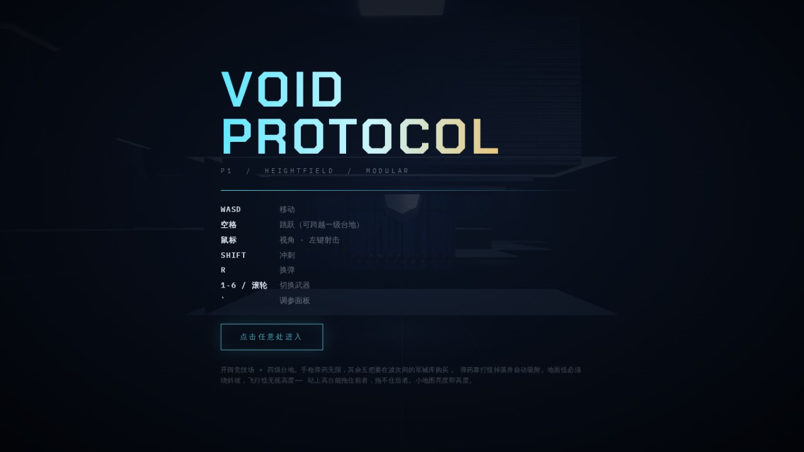

这篇是**总目录**，我做的所有能在浏览器里直接玩的 Demo 都会往这儿加，所以我把它置顶了。

不用下载、不用装插件、不用注册账号——点开链接就是游戏本身。建议用**电脑 + Chrome / Edge**，两个 Demo 都是键鼠操作，手机上玩不了。

---

## 1 · VOID PROTOCOL — 第一人称波次射击

  <a href="/games/void-protocol/" target="_blank" rel="noopener"
     style="display:inline-block;padding:.85em 2.4em;border-radius:8px;
            background:#05070c;color:#5fe6ff;border:1px solid #5fe6ff;
            font-weight:700;letter-spacing:.12em;text-decoration:none">
    ▶ 开始游戏
  </a>

开阔竞技场，四级台地地形，六把枪，怪一波比一波多。

**它的特别之处在于：整个游戏没有一个外部素材文件。** 贴图、音效、几何体、动画，全部是运行时用代码生成的——没有美术资源、没有音频文件、没有模型文件。整个游戏就是一个 HTML 文件加一份 three.js。

### 操作

| 键位 | 作用 |
|---|---|
| `WASD` | 移动 |
| `空格` | 跳跃（能跨越一级台地） |
| `鼠标` | 视角 / 左键射击 |
| `Shift` | 冲刺 |
| `R` | 换弹 |
| `1-6` / 滚轮 | 切换武器 |
| `` ` `` | 调参面板（光照、手感、视野的实时滑块，还有作弊开关） |

### 几个可能有用的提示

- 手枪弹药无限，另外五把要在**波次之间的军械库**里买，每把还能升三级；
- 弹药靠打怪掉落，走过去会自动吸附；
- 地面怪必须绕斜坡走，飞行怪无视高度差——**站上高台能拖住前者，拖不住后者**；
- 右下角小地图的**亮度就是高度**。

### 现在做到哪了

四个阶段的计划，P1（模块化 + 高度场地形 + 跳跃）和 P2（武器 + 弹药 + 经济 + 商店）已经完成，你现在玩到的就是这个版本。

P3 在做怪物铺量——从现在的 4 种铺到 14 种，包括自爆怪、盾卫、突刺者、分裂体，以及两个 BOSS。P4 是关卡与音画的打磨。

**下周一会上一版新的**，到时候直接覆盖这个链接，地址不变。

---

## 2 · 战线 FRONTLINE — 2.5D 即时战略

  <a href="/games/frontline/" target="_blank" rel="noopener"
     style="display:inline-block;padding:.85em 2.4em;border-radius:8px;
            background:#14100a;color:#e0a54a;border:1px solid #e0a54a;
            font-weight:700;letter-spacing:.12em;text-decoration:none">
    ▶ 开始游戏
  </a>

一个 RTS 的垂直切片。**没有农民，没有采矿**——资源直接来自你占领的据点，所以整局游戏你只需要关心一件事：战线往哪推。

三条机制撑起全部战术：

- **掩体决定伤害** — 沙袋和矮墙有朝向，正面减伤 34%~54%，被绕到侧后完全无效。部队抵达目的地会自动逐兵就近进驻掩体，不是整队一个判定；
- **压制决定推进** — 被密集火力覆盖会进入压制/钉扎状态，移速和精度暴跌。机枪班是压制之王；
- **侧翼决定胜负** — 前面两条加起来的结论。正面顶不动的阵地，绕后就能崩。

步兵可以进驻建筑，机枪和迫击炮需要停下架设、架好之后有射界限制，坦克和反坦克组之间是明确的克制链。

### 操作

| 键位 | 作用 |
|---|---|
| `左键拖拽` | 框选部队 |
| `右键` | 移动 / 攻击 |
| `A + 左键` | 攻击移动 |
| `右键点建筑` | 步兵进驻 |
| `T` | 撤退回基地（会补员） |
| `Q W E R F G` | 生产单位 |
| `1-4` | 编队（`Ctrl` + 数字设定） |
| `方向键` / 屏幕边缘 | 移动视角 |
| `H` | 帮助 |

三个难度：巡逻队（资源 ×0.8）、正规军（对等）、精锐师（资源 ×1.3）。

### 现在做到哪了

核心循环是完整的，一局大概 10 分钟左右能分出胜负。开发过程中我写了一个无头测试台，跑同代码对打来验证地图和数值的对称性——它抓出过四个肉眼绝对看不出来的 bug，比如开火遍历顺序固定导致数组靠前的一方总是先造成伤害，比如建筑入口写死南侧导致地图上半区的一方永远要绕路。最近一次 20 场对称回归是 10:10。

已知还没做的：AI 不会用专精兵种（它把迫击炮和机枪当步枪使），机枪班和装甲车的价值还没调出来，移动端完全没适配。

---

## 后续

还有几个 Demo 在排队，做完一个往这儿挂一个。这篇文章会一直置顶，收藏这一篇就够了。

有 bug、有建议，或者单纯想骂两句手感，都欢迎在下面评论区留言。
